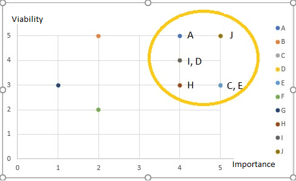
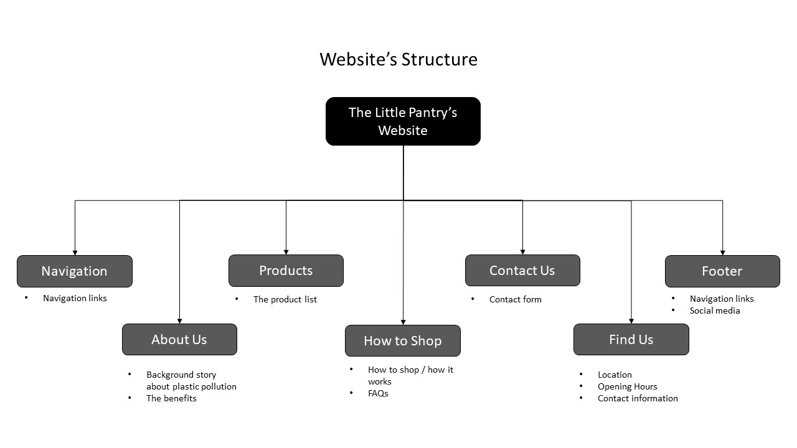
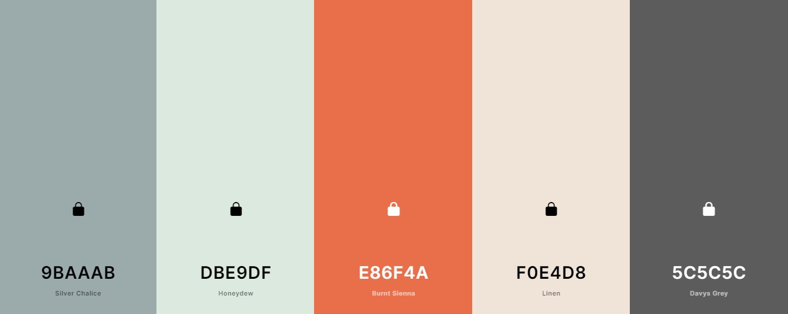

# The Little Pantry
 

  

[View live website here](https://dissyulina.github.io/the-little-pantry/)

<br/>

**Table of Contents**  
1. [Introduction](https://github.com/dissyulina/the-little-pantry#introduction)  
2. [UX Development Planes](https://github.com/dissyulina/the-little-pantry#development-plane)   
   i. [Strategy Plane](https://github.com/dissyulina/the-little-pantry#1-strategy-plane)  
   &nbsp;&nbsp;&nbsp;&nbsp;&nbsp;&nbsp;&nbsp;- [User Stories](https://github.com/dissyulina/the-little-pantry#user-stories)  
   &nbsp;&nbsp;&nbsp;&nbsp;&nbsp;&nbsp;&nbsp;- [Online Research](https://github.com/dissyulina/the-little-pantry#online-research)  
   &nbsp;&nbsp;&nbsp;&nbsp;&nbsp;&nbsp;&nbsp;- [Project Goals, User Goals, and Business Goals](https://github.com/dissyulina/the-little-pantry#project-goals)  
   &nbsp;&nbsp;&nbsp;&nbsp;&nbsp;&nbsp;&nbsp;- [Strategy Table](https://github.com/dissyulina/the-little-pantry#strategy-table)

   ii. [Scope Plane](https://github.com/dissyulina/the-little-pantry#2-scope-plane)  
   iii. [Structure Plane](https://github.com/dissyulina/the-little-pantry#3-structure-plane)  
   iv. [Skeleton Plane / Wireframes](https://github.com/dissyulina/the-little-pantry#4-skeleton-plane)  
   v. [Surface Plane / High Fidelity Mock Up](https://github.com/dissyulina/the-little-pantry#5-surface-plane)  
   &nbsp;&nbsp;&nbsp;&nbsp;&nbsp;&nbsp;&nbsp;- [Color Scheme](https://github.com/dissyulina/the-little-pantry#color-scheme)  
   &nbsp;&nbsp;&nbsp;&nbsp;&nbsp;&nbsp;&nbsp;- [Typography](https://github.com/dissyulina/the-little-pantry#typography)  
   &nbsp;&nbsp;&nbsp;&nbsp;&nbsp;&nbsp;&nbsp;- [Imagery](https://github.com/dissyulina/the-little-pantry#imagery)  

3. [Features](https://github.com/dissyulina/the-little-pantry#features)  
   i. [Existing Features](https://github.com/dissyulina/the-little-pantry#existing-features)  
   ii. [Features to be Implemented in The Future](https://github.com/dissyulina/the-little-pantry#features-to-be-implemented-in-the-future)  

4. [Technology Used](https://github.com/dissyulina/the-little-pantry#technologies-used)  
   i. [Main and Additional Languanges](https://github.com/dissyulina/the-little-pantry#main-languages-used)  
   ii. [Frameworks, Libraries, & Programs Used](https://github.com/dissyulina/the-little-pantry#frameworks-libraries--programs-used)  

5. [Issues and Bugs](https://github.com/dissyulina/the-little-pantry#issues-and-bugs)  
6. [Deployment](https://github.com/dissyulina/the-little-pantry#deployment)  
   i. [Deploy to Github](https://github.com/dissyulina/the-little-pantry#deployment-to-github-pages)  
   ii. [Forking to Github Repository](https://github.com/dissyulina/the-little-pantry#forking-the-github-repository)  
   iii. [Making a Local Clone](https://github.com/dissyulina/the-little-pantry#making-a-local-clone)  

7. [Testing](https://github.com/dissyulina/the-little-pantry#testing)   
   i. [Go to TESTING.md](https://github.com/dissyulina/the-little-pantry/blob/master/TESTING.md)  

8. [Credits](https://github.com/dissyulina/the-little-pantry#credits)  
   i. [Code](https://github.com/dissyulina/the-little-pantry#code)  
   ii. [Images](https://github.com/dissyulina/the-little-pantry#images)  
   iii. [Contents](https://github.com/dissyulina/the-little-pantry#contents)

9. [Acknowledgements](https://github.com/dissyulina/the-little-pantry#acknowledgements)  

<br/>


## **Introduction**


Welcome to the website of The Little Pantry!

The Little Pantry is a small plastic-free grocery shop located in Den Haag, The Netherlands. In this shop, you can buy your daily food items, such as fruits, vegetables, pasta, dry spices, nuts, oats, coffee, etc, in any amount that you like or need. The website is a one-page website, it features an about page, products that the shop sells, step by step on how to shop, a contact form, and a find us section.

Please note that this company is fictional and was created for the Code Institute’s Milestone Project 1 as part of their Diploma in Full Stack Software Development. The requirements are to make a static front-end website, using HTML, CSS, and (optional) Bootstrap or other CSS frameworks.  

<br />  

## **Development Plane**
 
### **1. Strategy Plane** 

As The Little Pantry is a fictional business, a strategic UX research was done through: 
* Interviews with a few potential users.
* An interview with a zero-waste enthusiast.
* Online research of competitors (similar shops located in the same city), and news related to the rising of the plastic-free shop.

Below are the result of the comprehensive and detailed interviews and research that have been conducted.  


   ### **User Stories**
 - **First Time Visitor Goal**
    1. As a first-time visitor, I want to easily navigate throughout the site and find the contents.
    2. As a first-time visitor, I want to get a great first impression in terms of the visual aspect of the website, so I'm interested to scroll down and find out more.
    3. As a first-time visitor, I want to easily understand the shop’s concept and how it works. 
    4. As a first-time visitor, I want to know what kind of products are sold in this shop.
    5. As a first-time visitor, I want to know the location and opening hours of this shop.
    6. As a first-time visitor, I want to locate their social media links to see their followings on social media to look for reviews and other information (if any).

 - **Returning Visitor Goal**  
    1. As a returning visitor, I want to find out if there’s an information page to answer the questions that I may have.
    2. As a returning visitor, I want to find all options available if I want to contact the shop.  

 - **Frequent Visitor Goal**  
    1. As a frequent user, I want to check to see if there are any newly added products or services.
    2. As a frequent user, I want to sign up for the Newsletter so that I am emailed any major updates and/or changes to the website or the shop.
    3. As a frequent user, I want to find their social media links and follow them.
    4. As a frequent user, I want to read some blog articles about how to live zero waste or environment articles.


### **Online Research**
   1. Customer Research  
       According to research by Afval Barometer from SUEZ (source: afvalgids.nl), 95% of Netherlands residents agree that separating the trash (into plastic, glass, paper, and the rest) is important, but only 60% do it. The Little Pantry is created as an alternative to a regular supermarket, so instead of separating the trash which requires more effort, we remove the packaging altogether.  

   2. Competitor Research  
       According to online research that I did, some similar businesses to The Little Pantry were found in Den Haag, The Netherlands.  
         * [Lekkernasuh](https://lekkernassuh.org)  
         Lekkernassuh is a physical plastic/packaging-free shop, almost similar to The Little Pantry. However, they are located in a sports hall, and only opens for 3 hours, once every two weeks (on Saturday). It is more of a community market, and the workers are all volunteers, so it lacks a clean, modern, and professional feel to it.
         * Traditional Markets in Den Haag  
         There are also traditional markets in Den Haag, where you can buy fruits, vegetables, meat, etc. In this type of market, the food items are typically not in plastic packaging, so you can always shop plastic-free. However, as many traditional markets usually are, they don’t have a website and are lacking food items such as beans, grains, dry spices, etc. 


   ### **Project Goals**
   The project goal is to provide an informational and promotional website of The Little Pantry, for customers and potential customers, so that they’re interested to visit and shop regularly at The Little Pantry.  


   ### **User Goals**
   The target audience for this website is:
   - Young adult to adult, 20-50 years old
   - Living in Den Haag, The Netherlands
   - Care about the environmental issue
   - Have started or think about starting to reduce waste in their daily lives
   - More modern and minimalistic lifestyle  

   The user's goal when visiting this website is to get comprehensive information about The Little Pantry, as a plastic-free / packaging-free grocery shop.  


   ### **Business Goals**
   The business concept itself is relatively new, therefore the website has to provide clear and relevant information about the buying process and what the customer can expect when they visit the shop. 
   - To create an online presence of the shop. 
   - To acquire new customers to the business
   - To introduce a plastic-free concept in grocery shopping and how it works to potential customers.
   - And finally, to create a customer engagement to the shop, making The Daily Pantry their regular choice for grocery shopping.  

[Back to top](https://github.com/dissyulina/the-little-pantry#the-little-pantry)  


   ### **Other Considerations**
   The Little Pantry has a Business-To-Customer (B2C) product, which has considerations as below:  
   * Headline and content are catchy and compelling.
   * Minimal content, large images.
   * The design stands out amongst the competitors.  
   
   However, it has a slightly different purpose from other B2C. The end goal of a normal B2C is for the user to click “buy” or to make a purchase, but in this case, the end goal is for the user to visit the shop (and to make a purchase there). So, in this case, this website has only an informational/ promotional purpose.  
   

   ### **Strategy Table**
   Based on these research, goals, and the considerations above, I brainstormed all of the opportunities that could be implemented in the website. All of those opportunities were mapped based on their importance (driven by business goals and user needs), and viability (given limited time and resources), to determine which opportunities were going to be included and which were not.  

   Opportunities / Features | Importance | Viability
   --- | --- | ---
   A. Background story about plastic pollution | 4 | 5
   B. Story about The Little Pantry | 2 | 5
   C. The benefits | 3 | 3
   D. The product list | 4 | 4
   E. How it works | 5 | 3
   F. Photo gallery | 2 | 2
   G. Testimonials / Reviews | 1 | 3
   H. Contact form | 4 | 3
   I. FAQs | 4 | 4
   J. Location, Opening Hours | 5 | 5   


   The chart below is the mapping of all of the opportunities. The yellow circle signifies which opportunities/ features have the highest combination of importance and viability.  

   

<br />  

[Back to top](https://github.com/dissyulina/the-little-pantry#the-little-pantry)  


### **2. Scope Plane** 
Based on the mapping in Strategy Plane, I decided to include these contents below in the website:
-	Background story about plastic pollution
-	The product list
-	How it works
-	The benefits
-	Contact form
-	FAQs
-	Location and Opening hours  

Functionality requirements:
-	The user can navigate easily through the website to access all the contents
-	The user can easily contact the shop

<br/>

### **3. Structure Plane** 
The contents were organized in a Hierarchical Tree Structure that ensures the user navigates easily and intuitively.



These contents were implemented on a single-page website, in consideration of:
-  The user can see and read the contents quickly and with less learning curve.
-  There’s only one single product that we are promoting (in this case The Little Pantry), so it has to be simple and straightforward.
-  The end goal is: for the user to visit the store. The user doesn’t purchase on the website, so it’s better to keep the complexity of the information minimum.  

<br />

[Back to top](https://github.com/dissyulina/the-little-pantry#the-little-pantry)  


### **4. Skeleton Plane** 
Wireframes were created using Figma to design the navigation and interface of the website. The developer designed it with a good UI design in mind, which allows immediate interaction in first-time learning, and perfectly meets the needs of the intended audience.  

The wireframes can be found in the link below:  

  * [Wireframes for desktop](assets/wireframes/wireframes-desktop.png)  
  * [Wireframes for tablet](assets/wireframes/wireframes-tablet.png)  
  * [Wireframes for mobile](assets/wireframes/wireframes-mobile.png)  

<br />

### **5. Surface Plane** 
For better and clearer visualization before coding, and also to check if the color scheme and images work great together, a high-fidelity mockup for desktop was made, and can be found in the link below.  
[High-fidelity mock up for desktop](assets/wireframes/high-fidelity-mockup-desktop.png)


   #### **Color Scheme**  
   The colors used are primarily derived from the logo, the hero image, and other images in the website, to create a cohesive color scheme from beginning to end. I used [Coolors](https://coolors.co) to identify the three colors (in the middle) from the images and add another two colors that fit well with the other three.  
     


   #### **Typography**  
   All of the fonts were sourced from the [Google Fonts](https://fonts.google.com).  

   *	Main font: Roboto  
     Roboto is used as the main font, for all paragraphs, and links in navbar and footer. Roboto was chosen because it has modern, clean, and simple style of a sans-serif font, and following the recommendation in Google fonts of popular pairing font with Merriweather.  

   * Secondary font: Merriweather  
     Merriweather is used as the header (h1 – h5) font for the website. It was chosen first, since I wanted to choose a beautiful and impactful font for the heading inside the hero-image, since that is the first impression of the website from the user’s perspective. 
   Merriweather is also used as a font for the quote in About Us section, to differentiate the quote with a normal paragraph and make it stands out more.

   * Tertiary font: Comfortaa  
     Comfortaa is a cursive font, and used only for the logo.  


   #### **Imagery**  
   These images were sourced from [Freepik](https://www.freepik.com), [Pexels](https://www.pexels.com), and [Unsplash](https://unsplash.com).  
   * Hero Image is chosen because it’s minimalistic, so the heading text can stand out more, and it’s giving a clean and fresh feeling of living “zero-waste”.
   * All of the images in the website were taken from a free stock-photos website, as representations of what’s inside the shop, to provide clear imagery to the user and let the user know what to expect (the products sold, what the bulk-system is, etc.)  

<br />

[Back to top](https://github.com/dissyulina/the-little-pantry#the-little-pantry)  


## **Features**  
### **Existing Features**  
1. **Navigation Bar (Navbar)**  
      * The Navbar consists of a Logo on the left side that links to the top of the site, and five navigation links (nav-links) on the right side that link to the sections. It occupies 100% width of the site.  
      * The Navbar is fully responsive on all device sizes. On desktop view, the user can see all the nav-links, while on a smaller device, the nav-links collapse to a hamburger menu. 
      * The Nav-links have an active state which changes according to which section the user is currently looking at.  
      * The Nav-links have a subtle hover state  when the user hovers over them.  
      * The Navbar is also fixed at the top of the user’s device screen, it follows along when the user scrolls down, so the user can easily navigate the site without scrolling back to the top.  

  2. **Hero Page / Header**  
     * The hero-image covers 100% of the viewport height and width, with an  impactful heading in a jumbotron to give the user a great first impression.  
     * The main color of the hero-image is mint-green, which gives a fresh, clean, and modern feeling to the website. 
     * The jumbotron is fully responsive on all device sizes. On a mobile device, it is vertically and horizontally centered, with the header text aligns to the left. While on a larger device, it aligns to the right.  
     * There's a Call To Action button that leads to the most important information on the site, which is the How to Shop section. 

  3. **About Section**  
     * The About Section consists of two sub-sections: What We Are and Why Shop With Us.
     * Both of the sub-sections are wrapped in a container, which has a fully responsive maximum width on device sizes.  
     * There are four cards in Why Shop With Us sub-section, that are positioned in a fully responsive grid system, where on a large screen the cards were spread into 4 columns and 1 row, on a medium screen they become 2 rows and 2 columns, and on a small screen, they become stacked on top of each other.    
     
  4. **Products Section**  
     * The Product Section is divided into two columns with the same width on the desktop and becomes stacked on top of each other in one column on mobile and tablet devices. The first column, on the left, is a carousel of product photos. While the second column, on the right, is the description of what kinds of products are sold in the shop.  
     * The carousel of product photos occupies 50% of the page on desktop, and 100% width on mobile and tablet, which therefore also acts as a divider. It consists of three images that represent some of the products that are sold: grains and beans in containers, the spices in jars, and zero-waste housewares.  
     * The description of what kind of products are sold also occupies 50% of the page on desktop, and 100% width on mobile and tablet. It ends with a button to download/ open a complete product list. This product list is a pdf file that opens in a new tab to ensure the user can navigate back to the site easily. 

  5. **How to Shop Section**   
     * The How to Shop Section consists of three Sub-sections: 3 Steps of How to Shop, FAQs, and Did You Know sub-section. The Call To Action button in the Header leads to this section.
     * The 3 steps are wrapped in a container that has a fully responsive maximum width on device sizes. On desktop it’s positioned in one row, on tablet it becomes two rows (with one step is centered in the second row), and on mobile, it becomes three rows on top of each other.  
     * The FAQs sub-section answers some of the questions that might come into the user’s mind after reading how it works. There are 3 questions and the answer is hidden under each question. A toggle button is used to show/hide the answer, which is positioned after each question. This style was chosen in purpose of:  
        - To minimize the amount of information that the user might not find important. The user can choose which answer they want to find out, so we can retain the user’s attention.  
        - To use the space effectively, keeping in mind that this is a single-page website.  
     * The Join mailing list form is inline, consists of an e-mail input and a Join button. The e-mail input is required; hence the user has to fill it out correctly before clicking the Join button. After the email is filled correctly and the Join button is clicked, there’s a modal pop-up as a Thank You message. The modal appears in the center of the screen and can be close by clicking the Close button, or a usual ‘X' button at the top-right side.

  6. **Contact Section** 
     * The background image for the contact form is an image of the shop so that the user can better visualize the situation in the shop. To help the readability of the form, an image overlay was positioned in the center, with high opacity.  
     * The contact form has three inputs: Name, E-mail address, and Message. All of them must be filled out correctly for the user to be able to successfully send the form. After the form is successfully sent, there’s a modal pop-up as a response to let the user know that the shop has received the message. The modal appears in the center of the screen and can be close by clicking the Close button, or a usual ‘X' button at the top-right side.  

  7. **Find Us Section**  
     The Find Us section consists of information on the left side, and a google map on the right side. They are positioned side by side on tablet and desktop, and become on top of each other on mobile. The information contains the address, the opening hours, the phone number, and the email address of the shop. 

  8. **Footer**  
     The Footer uses the same color as the Navbar and provides the social media links of the shop, that opens in a new tab. The footer also contains alternative navigation links to all the sections, and the logo that leads back to the top of the page. On tablet and desktop, the navigation links are spread out from left to right in one row, while the logo and social media links occupy the second row. On mobile, they become one row in the center, stack on top of each other.  

### **Features to be implemented in the future**  
These features can be implemented in the future on the next development phase:  
   * A multi-page website, consisting:
      - An additional page of complete FAQs.
      - Another additional page for blog/ article about zero waste tips and new updates of the shop.
   * Option/ toggle button to change the language of the website to Dutch, as it is located in The Netherlands.
   * Add CAPTCHA to the contact form to allows better security from spam. 

<br />

[Back to top](https://github.com/dissyulina/the-little-pantry#the-little-pantry)  


## **Technologies Used**  
### **Main Languages Used**
   * [HTML5](https://en.wikipedia.org/wiki/HTML5)
   * [CSS3](https://en.wikipedia.org/wiki/Cascading_Style_Sheets)  

### **Additional Languages Used**
   * [JavaScript](https://en.wikipedia.org/wiki/JavaScript)  
      JavaScript was used to implement functions that allowed the Hamburger menu in Navbar to close/collapse back after choosing, and to show a notification modal as a response after submitting a validated form, both were applied for a better UX.  

### **Frameworks, Libraries & Programs Used**  
   1. [Bootstrap 4.6, including jQuery and Popper.js](https://getbootstrap.com/docs/4.6/getting-started/introduction/)  
   Bootstrap was used to assist with the responsiveness and styling of the website. Bootstrap 4 uses jQuery and Popper.js for JavaScript components (like modals, scrollspy, navbar, etc).  
   2. [Google Fonts](https://fonts.google.com)  
   Google fonts was used to import the “Roboto”, “Merriweather”, and “Comfortaa” fonts into the html file, and were used on all parts of the site.  
   3. [Font Awesome](https://fontawesome.com)  
   Font Awesome was used throughout the website to add icons for aesthetic and UX purposes.
   4. [Git](https://git-scm.com)  
   Git was used for version control by utilizing the Gitpod terminal to commit to Git and Push to GitHub.  
   5. [GitHub](https://github.com)  
   GitHub was used to store the projects code after being pushed from Git. 
   6. [Figma](https://www.figma.com)  
   Figma was used to create the wireframes and the high fidelity mock up during the design process.  
   7. [Autoprefixer CSS](https://autoprefixer.github.io)  
   Autoprefixer CSS was used to add vendor prefixes to the CSS rules, to ensure that they work across all browsers.   
   8. [Am I Responsive](ami.responsivedesign.is)  
   Am I Responsive was used to preview the website across a variety of popular devices. 
   9. [Hatchful](https://hatchful.shopify.com)  
   Hatchful was used to create the logo.
   10. [Tiny JPG](https://tinyjpg.com)  
   Tiny JPG was used to reduce the file size of the images.
   11. [Coolors](https://coolors.co)  
   Coolors was used to create a cohesive color scheme for the website.
   
<br /> 

[Back to top](https://github.com/dissyulina/the-little-pantry#the-little-pantry)  


## **Issues and Bugs**  

I ran into several issues and bugs while developing the website. Some of the tough ones are listed below, along with the solutions that successfully solved them.
1. **Issue:** On mobile and tablet, the page could be moved left and right a little.  
   **Solution:** After spending much time investigating with the developer tools, the root problem was found. The problem was the bootstrap class ‘container-fluid’, which had padding-left and padding-right 15px, and followed by bootstrap class ‘row’, which had margin-left and margin-right -15px. The solution for this was fairly simple, which to set:
   ```
   .container-fluid {
	   padding-left: 0;
	   padding-right: 0; 
   }
   .row {
	   margin-left: 0;
	   margin-right: 0; 
   }
   ```

2. **Issue:** The hamburger menu (Navbar) on mobile device didn’t automatically collapse/ close back after the user choose a section.  
**Solution:** Use a jQuery function, to collapse the hamburger menu after a navigation link is clicked. Code adapted from [this page](https://stackoverflow.com/questions/42401606/how-to-hide-collapsible-bootstrap-navbar-on-click) on Stackoverflow.   

3. **Issue:** The Nav-links didn’t have an active state (which of the section the user currently sees), due to a single-page website.  
**Solution:** Set a scrollspy from bootstrap, which automatically updates the navigation links based on scroll position, to indicate which link is currently active in the viewport. Code adapted and modified from [this page](https://getbootstrap.com/docs/4.6/components/scrollspy/) on Bootstrap Documentation.  

4. **Issue:** After the user clicks the ‘Send Message’ button or ‘Join’ button, there’s no notification or message that the form has been submitted successfully. If a Modal was set after the ‘Send’ button is clicked, the modal will appear even if the user didn’t fill out the form correctly, so it will contradict the required attribute.  
**Solution:** Use a jQuery function, that only shows the modal after the form has been validated. Also, after the form has been submitted, the form is reset so the input fields are empty again. Code adapted from [this page](https://stackoverflow.com/questions/46054499/open-modal-bootstrap-on-submit-form) on Stackoverflow.  

5. **Issue:** Images with background-attachment: fixed, didn’t work on Safari browsers on mobile and tablet (iOS).  
**Solution:** Originally, the Hero-Image and background image in the Contact section had fixed attachments. Unfortunately, these fixed background images didn’t work on Safari iOS (it’s a known bug). To solve this, I used a media-query to set the background-attachment to scroll on mobile and tablet (set the max-width to 1024px, as it's the max-width of iPad). 

<br />  

[Back to top](https://github.com/dissyulina/the-little-pantry#the-little-pantry)  


## **Deployment**  
The project was developed using Gitpod as the code editor, committed to Git as a local repository, and finally pushed/ stored to GitHub. 

### **Deployment to GitHub Pages**  
The project was deployed to GitHub Pages using the following steps:
1.	Log in to GitHub.
2.	Navigate to the main page of GitHub Repository that will be deployed.
3.	At the top of the Repository, locate the "Settings" button on the menu and click it.
4.	Inside the Settings, on the left side of the page, there’s a list of tab menu. Locate the “Pages” tab, and click it.
5.	Under "Source", click the dropdown called "None", select "Master", and then click the “Save” button.
6.	The page will automatically refresh.
7.	There’s a notification message that provides the now published site link: “Your site is ready to be published at https://dissyulina.github.io/the-little-pantry/”.  


### **Forking the GitHub Repository**  
By forking the GitHub repository you can make a copy of the original repository on your GitHub account to view and/or make changes without affecting the original repository, by using the following steps:
1.	Log in to GitHub.
2.	Navigate to the main page of the GitHub Repository that you want to fork.
3.	At the top right of the Repository just below your profile picture, locate the "Fork" Button.
4.	You should now have a copy of the original repository in your GitHub account.  

Changes made to the forked repository can be merged with the original repository via a pull request.  

### **Making a Local Clone** 
By cloning a GitHub Repository you can create a local copy on your computer of the remote repository. This allows you to make all of your edits locally rather than directly in the source files of the origin repository, by using the following steps:  
1.	Log in to GitHub 
2.	Navigate to the main page of the GitHub Repository that you want to clone.
3.	Above the list of files, click the dropdown called "Code".
4.	To clone the repository using HTTPS, under "HTTPS", copy the link.
5.	Open Git Bash.
6.	Change the current working directory to the location where you want the cloned directory to be made.
7.	Type git clone, and then paste the URL you copied in Step 4.  
```
$ git clone https://github.com/YOUR-USERNAME/YOUR-REPOSITORY
```
8. Press Enter. Your local clone will be created.
```
$ git clone https://github.com/YOUR-USERNAME/YOUR-REPOSITORY
> Cloning into `CI-Clone`...
> remote: Counting objects: 10, done.
> remote: Compressing objects: 100% (8/8), done.
> remove: Total 10 (delta 1), reused 10 (delta 1)
> Unpacking objects: 100% (10/10), done.
```  
Changes made on the local machine (cloned repository) can be pushed to the upstream repository directly if you have a write access for the repository. Otherwise, the changes made in the cloned repository are first pushed to the forked repository, and then a pull request is created.  
Click [Here](https://docs.github.com/en/github/creating-cloning-and-archiving-repositories/cloning-a-repository-from-github/cloning-a-repository) to retrieve pictures for some of the buttons and more detailed explanations of the above process.  

<br />  

[Back to top](https://github.com/dissyulina/the-little-pantry#the-little-pantry)  


## **Testing**  
The testing documentation can be found [here](https://github.com/dissyulina/the-little-pantry/blob/master/TESTING.md). 


<br />  

## **Credits** 
### **Code**
1. Bootstrap 4.6: Bootstrap Library was heavily used throughout the project, including these Bootstrap components below: 
   * Scrollspy: https://getbootstrap.com/docs/4.6/components/scrollspy/
   * Collapsible Navbar: https://getbootstrap.com/docs/4.6/components/navbar/
   * Cards:
  https://getbootstrap.com/docs/4.6/components/card/
   * Carousel: https://getbootstrap.com/docs/4.6/components/carousel/
   * Grid System: https://getbootstrap.com/docs/4.6/layout/grid/
   * Toggle Collapse: https://getbootstrap.com/docs/4.6/components/collapse/
   * Modal: https://getbootstrap.com/docs/4.6/components/modal/
   * Form: https://getbootstrap.com/docs/4.6/components/forms/  
2. Stackoverflow
   * To collapse back the hamburger menu after clicking a section: https://stackoverflow.com/questions/42401606/how-to-hide-collapsible-bootstrap-navbar-on-click
   * To show a modal after the user send a valid form: https://stackoverflow.com/questions/46054499/open-modal-bootstrap-on-submit-form  

### **Images**
   * The logo was created using a free logo maker [Hatchful](https://hatchful.shopify.com).
   * The photos used in the website were obtained from [Freepik](https://www.freepik.com), [Pexels](https://www.pexels.com), and [Unsplash](https://unsplash.com). The complete source is attributed in ```alt``` and ```title``` attribute on the image.
   * The icons used in the website were sourced from [Font Awesome](https://fontawesome.com).  


### **Contents**
   * Contents for the downloadable Product List was sourced from [Lekkernasuh](https://lekkernassuh.org/over-lekkernassuh/verpakkingsvrije-winkel/).
   * Contents for About Section was sourced and summarized from [Packaging waste](https://supplychain.edf.org/resources/sustainability-101-packaging-waste-the-problem/).

<br/>

## **Acknowledgements**
   * My mentor, Oluwaseun Owonikoko, for the helpful feedback on every detail of the website.
   * My bestfriends, for the great insight over living zero-waste and plastic-free grocery shop.
   * My husband Sandi, for his daily continuous support and for testing the website across our mobile devices.
   * Slack community, as the first help to ask when I encountered a problem.

[Back to top](https://github.com/dissyulina/the-little-pantry#the-little-pantry)  
