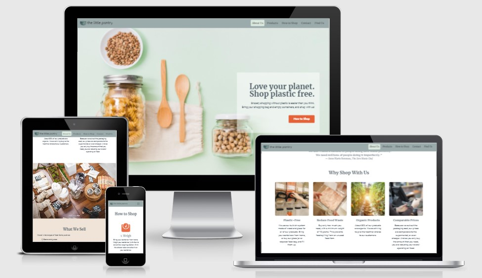
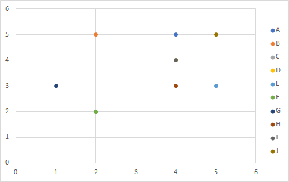
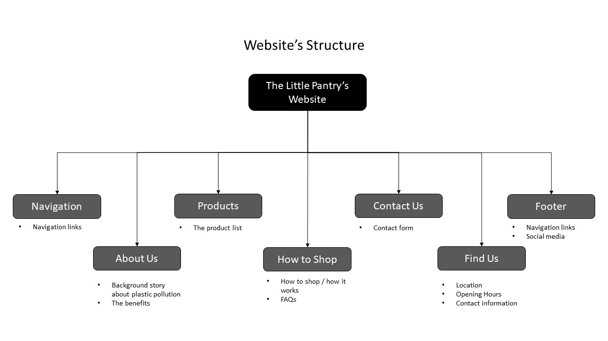
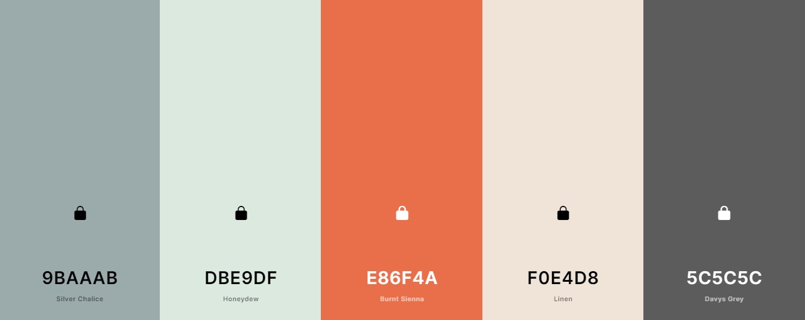

# The Little Pantry
 

## **Introduction**

Welcome to the website of The Little Pantry!

The Little Pantry is a small plastic-free grocery shop located in Den Haag, The Netherlands. In this shop, you can buy your daily food items, such as fruits, vegetables, pasta, dry spices, nuts, oats, coffee, etc, in any amount that you like or need. The website is a one-page website, it features an about page, products that the shop sells, step by step on how to shop, a contact form, and a find us section.

Please note that this company is fictional and was created for the Code Institute’s Milestone Project 1 as part of their Diploma in Full Stack Software Development. The requirements are to make a static front-end website, using HTML, CSS, and (optional) Bootstrap or other CSS frameworks.  

 

## **Development Plane**
   

### **1. Strategy Plane** 

As The Little Pantry is a fictional business, a strategic UX research was done through: 
* Interviews with a few potential users.
* An interview with a zero-waste enthusiast.
* Online research of competitors (similar shops located in the same city), and news related to the rising of the plastic-free shop.

Below are the result of the comprehensive and detailed interviews and research that have been conducted.  
 

   #### **User Stories**
 - **First Time Visitor Goal**
    1. As a first-time visitor, I want to easily navigate throughout the site and find the contents.
    2. As a first-time visitor, I want to get a great first impression in terms of the visual aspect of the website, so I'm interested to scroll down and find out more.
    3. As a first-time visitor, I want to easily understand the shop’s concept. 
    4. As a first-time visitor, I want to know what kind of products are sold in this shop.
    5. As a first-time visitor, I want to understand the benefit of buying products in this shop.
    6. As a first-time visitor, I want to know how it works when I want to visit and buy something at this shop, so I can prepare beforehand.
    7. As a first-time visitor, I want to know the location and opening hours of this shop.
    8. As a first-time visitor, I want to locate their social media links to see their followings on social media to look for reviews and other information (if any).

 - **Returning Visitor Goal**  
    1. As a returning visitor, I want to find out if there’s an information page to answer the questions that I may have.
    2. As a returning visitor, I want to find all options available if I want to contact the shop.  

 - **Frequent Visitor Goal**  
    1. As a frequent user, I want to check to see if there are any newly added products or services.
    2. As a frequent user, I want to sign up for the Newsletter so that I am emailed any major updates and/or changes to the website or the shop.
    3. As a frequent user, I want to find their social media links and follow them.
    4. As a frequent user, I want to read some blog articles about how to live zero waste or environment articles.

   

   #### **Online Research**
   1. Customer Research  
       According to research by Afval Barometer from SUEZ (source: afvalgids.nl), 95% of Netherlands residents agree that separating the trash (into plastic, glass, paper, and the rest) is important, but only 60% do it. The Little Pantry is created as an alternative to a regular supermarket, so instead of separating the trash which requires more effort, we remove the packaging altogether.  

   2. Competitor Research  
       According to online research that I did, some similar businesses to The Little Pantry were found in Den Haag, The Netherlands.  
         * [Lekkernasuh](https://lekkernassuh.org)  
         Lekkernassuh is a physical plastic/packaging-free shop, almost similar to The Little Pantry. However, they are located in a sports hall, and only opens for 3 hours, once every two weeks (on Saturday). It is more of a community market, and the workers are all volunteers, so it lacks a clean, modern, and professional feel to it.
         * Traditional Markets in Den Haag  
         There are also traditional markets in Den Haag, where you can buy fruits, vegetables, meat, etc. In this type of market, the food items are typically not in plastic packaging, so you can always shop plastic-free. However, as many traditional markets usually are, they don’t have a website and are lacking food items such as beans, grains, dry spices, etc. 
         * [Pieter Pot](https://www.pieter-pot.nl)  
         There’s also an online packaging-free shop, which has no physical shop. They deliver your grocery in glass jars (where you also pay for the jars), and at the next delivery you give the jars back (then you also get your money back). The website looks quite professional, but as I mentioned before, what they are lacking is a physical shop.  
 

   #### **Project Goals**
   The project goal is to provide an informational and promotional website of The Little Pantry, for customers and potential customers, so that they’re interested to visit and shop regularly at The Little Pantry.  
 

   #### **User Goals**
   The target audience for this website is:
   - Young adult to adult, 20-50 years old
   - Living in Den Haag, The Netherlands
   - Care about the environmental issue
   - Have started or think about starting to reduce waste in their daily lives
   - More modern and minimalistic lifestyle 
   The user's goal when visiting this website is to get comprehensive information about The Little Pantry, as a plastic-free / packaging-free grocery shop.  
 

   #### **Business Goals**
   The business concept itself is relatively new, therefore the website has to provide clear and relevant information about the buying process and what the customer can expect when they visit the shop. 
   - To create an online presence of the shop. 
   - To acquire new customers to the business
   - To introduce a plastic-free concept in grocery shopping and how it works to potential customers.
   - And finally, to create a customer engagement to the shop, making The Daily Pantry their regular choice for grocery shopping.  

 

   #### **Website Considerations**
   The Little Pantry has a Business-To-Customer (B2C) product, which has considerations as below:  
   * Headline and content are catchy and compelling.
   * Minimal content, large images.
   * The design stands out amongst the competitors.  
   
   However, it has a slightly different purpose from other B2C. The end goal of a normal B2C is for the user to click “buy” or to make a purchase, but in this case, the end goal is for the user to visit the shop (and to make a purchase there). So, in this case, this website has only an informational/ promotional purpose.  
    

   #### **Strategy Table**
   Based on these research, goals, and the considerations above, I brainstormed all of the opportunities that could be implemented in the website. All of those opportunities were mapped based on their importance (driven by business goals and user needs), and viability (given limited time and resources), to determine which opportunities were going to be included and which were not.  

Opportunities / Features | Importance | Viability
--- | --- | ---
A. Background story about plastic pollution | 4 | 5
B. Story about The Little Pantry | 2 | 5
C. The benefits | 3 | 3
D. The product list | 4 | 4
E. How it works | 5 | 3
F. Photo gallery | 2 | 2
G. Testimonials / Reviews | 1 | 3
H. Contact form | 4 | 3
I. FAQs | 4 | 4
J. Location, Opening Hours | 5 | 5  

 

The chart below is the mapping of all of the opportunities. The yellow circle signifies which opportunities/ features have the highest combination of importance and viability.  

 

### **2. Scope Plane** 
Based on the mapping in Strategy Plane, I decided to include these contents below in the website:
-	Background story about plastic pollution
-	The product list
-	How it works
-	The benefits
-	Contact form
-	FAQs
-	Location and Opening hours  

Functionality requirements:
-	The user can navigate easily through the website to access all the contents
-	The user can easily contact the shop

 

### **3. Structure Plane** 
The contents were organized in a Hierarchical Tree Structure that ensures the user navigates easily and intuitively.

These contents were implemented on a single-page website, in consideration of:
-  The user can see and read the contents quickly and with less learning curve.
-  There’s only one single product that we are promoting (in this case The Little Pantry), so it has to be simple and straightforward.
-  The end goal is: for the user to visit the store. The user doesn’t purchase on the website, so it’s better to keep the complexity of the information minimum.  
 

### **4. Skeleton Plane** 
Wireframes were created using Figma to design the navigation and interface of the website. The developer designed it with a good UI design in mind, which allows immediate interaction in first-time learning, and perfectly meets the needs of the intended audience.  

The wireframes can be found in the link below:  

  * [Wireframes for desktop](assets/wireframes/wireframes-desktop.png)  
  * [Wireframes for tablet](assets/wireframes/wireframes-tablet.png)  
  * [Wireframes for mobile](assets/wireframes/wireframes-mobile.png)  

### **5. Surface Plane** 
For better and clearer visualization before coding, and also to check if the color scheme and images work great together, a high-fidelity mockup for desktop was made, and can be found in the link below.  
[High-fidelity mock up for desktop](assets/wireframes/high-fidelity-mockup-desktop.png)

   #### **Color Scheme**  
   The colors used are primarily derived from the logo, the hero image, and other images in the website, to create a cohesive color scheme from beginning to end. I used [Coolors](https://coolors.co) to identify the three colors (in the middle) from the images and add another two colors that fit well with the other three.  
     

   #### **Typography**  
   All of the fonts were sourced from the [Google Fonts](https://fonts.google.com).  

   *	Main font: Roboto  
     Roboto is used as the main font, for all paragraphs, and links in navbar and footer. Roboto was chosen because it has modern, clean, and simple style of a sans-serif font, and following the recommendation in Google fonts of popular pairing font with Merriweather.  

   * Secondary font: Merriweather  
     Merriweather is used as the header (h1 – h5) font for the website. It was chosen first, since I wanted to choose a beautiful and impactful font for the heading inside the hero-image, since that is the first impression of the website from the user’s perspective. 
   Merriweather is also used as a font for the quote in About Us section, to differentiate the quote with a normal paragraph and make it stands out more.

   * Tertiary font: Comfortaa  
     Comfortaa is a cursive font, and used only for the logo.  

   #### **Imagery**  
   These images were sourced from [Freepik](https://www.freepik.com), [Pexels](https://www.pexels.com), and [Unsplash](), and are referenced in the code in the alt attribute.  
   * Hero Image is chosen because it’s minimalistic, so the heading text can stand out more, and it’s giving a clean and fresh feeling of living “zero-waste”.
   * All of the images in the website were taken from a free stock-photos website, as representations of what’s inside the shop, to provide clear imagery to the user and let the user know what to expect (the products sold, what the bulk-system is, etc.)

