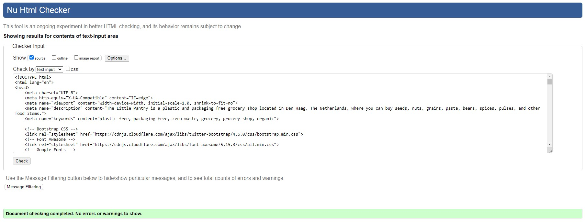
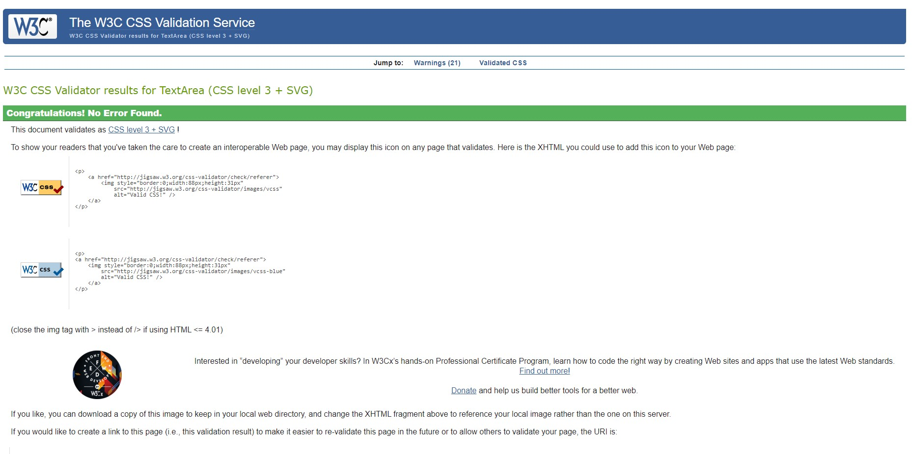
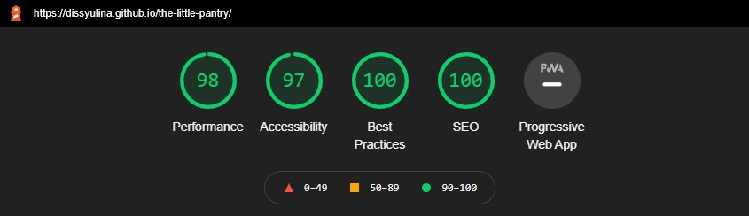
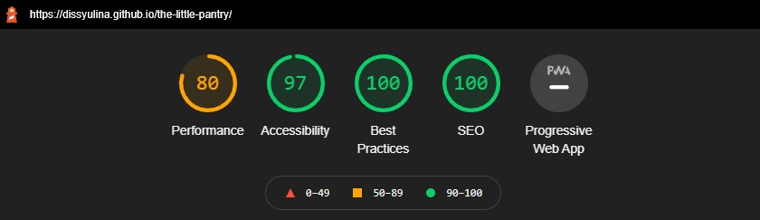

# The Little Pantry - Testing  

[Back to the main README.md file](https://github.com/dissyulina/the-little-pantry#the-little-pantry)  

[Back to the Testing section in main README.md file](https://github.com/dissyulina/the-little-pantry#testing)  

[View live website here](https://dissyulina.github.io/the-little-pantry/)  

<br/>  

**Table of Contents** 
1. [User Stories Testing](https://github.com/dissyulina/the-little-pantry/blob/master/TESTING.md#testing-user-stories)  
2. [Manual Testing](https://github.com/dissyulina/the-little-pantry/blob/master/TESTING.md#manual-testing)  
a. [Responsiveness Testing](https://github.com/dissyulina/the-little-pantry/blob/master/TESTING.md#responsiveness-testing)  
b. [Links Testing](https://github.com/dissyulina/the-little-pantry/blob/master/TESTING.md#links-testing)  
c. [Forms Testing](https://github.com/dissyulina/the-little-pantry/blob/master/TESTING.md#forms-testing)  
3. [Autoprefixer CSS](https://github.com/dissyulina/the-little-pantry/blob/master/TESTING.md#autoprefixer-css)  
4. [W3C Validator Testing](https://github.com/dissyulina/the-little-pantry/blob/master/TESTING.md#w3c-validator-testing)  
5. [Lighthouse Testing](https://github.com/dissyulina/the-little-pantry/blob/master/TESTING.md#lighthouse-testing)  
6. [CI Peer Code Review on Slack](https://github.com/dissyulina/the-little-pantry/blob/master/TESTING.md#ci-peer-code-review-on-slack)
7. [Further Testing](https://github.com/dissyulina/the-little-pantry/blob/master/TESTING.md#further-testing)  

<br/>  

---  

<br/>

## **User Stories Testing**
 - **First Time Visitor Goal**
    1. As a first-time visitor, I want to easily navigate throughout the site and find the contents.
       - The navigation bar is clearly defined and fixed to the top of the screen, it follows the scroll position, so on whichever section the user currently is, the user can navigate effortlessly.  
       - The logo image on the top of the page and the Footer, both lead the user back to the top of the page.  
       - The footer menu has the same navigation links as the navigation bar.  

    2. As a first-time visitor, I want to get a great first impression in terms of the visual aspect of the website, so I'm interested to scroll down and find out more.
       - The hero-image fits 100% of the viewport width and height, with an inviting header and sub-header.  
       - A call to action button inside the hero-image brings the user to the middle of the site.  

    3. As a first-time visitor, I want to easily understand the shop’s concept and how it works. 
       - The About section explains a short background story of the shop.  
       - The About section also describes the benefits that differentiate the shop from other grocery shops.  
       - The How to Shop section explains the steps of grocery shopping without plastic, and for the user to prepare beforehand.  
       - The Did You Know sub-section opens with one “Did you know” information, which builds the shop’s branding, that we are fully committed to zero waste.  

    4. As a first-time visitor, I want to know what kind of products are sold in this shop. 
       - The Product section provides the list of products that are sold in the shop.  
       - The Download our Product List button provides a complete list of products that are sold in the shop.  

    5. As a first-time visitor, I want to know the location and opening hours of this shop.
       - The Find Us section provides the information of location, opening hours, phone number, and email of the shop.  
       - The embedded google map in the Find Us section provides the map of the shop’s location.  

    6. As a first-time visitor, I want to locate their social media links to see their followings on social media to look for reviews and other information (if any).  
       - The Social Media links are located in the Footer. Each link is represented by an appropriate icon for easy identification of the social media platform.  


 - **Returning Visitor Goal**  
    1. As a returning visitor, I want to find out if there’s an information page to answer the questions that I may have.  
       - The FAQ sub-section provides the answers to some of the questions that the user might have.  
       - The contact form also functions as one of the options for the user to ask questions.  

    2. As a returning visitor, I want to find all options available if I want to contact the shop.  
       - The Contact section functions as the main means of communication for the user to contact the shop.  
       - The phone number of the shop is provided in Find Us section.  
       - The email address of the shop is also provided in the Find Us section if the user prefers to not use the Contact Form.  
       - The social media links also can be used as an option to contact the shop via social media messenger. The social media links are located in the Footer.  

 - **Frequent Visitor Goal**  
    1. As a frequent user, I want to check to see if there are any newly added products or services.
       - The Product section provides the list of products that are sold in the shop, including the new ones. The new products are tagged with a ‘New’ badge, so the user can know which products are newly added.  

    2. As a frequent user, I want to sign up for the Newsletter so that I am emailed any major updates and/or changes to the website or the shop.
       - The user can easily subscribe/ join the mailing list by filling out a very simple form, that consists of just one input field (the email address of the user). After the user fills out the email address and clicks the Join button, there’s a pop-up notification to ensure the user that the user has been successfully subscribed to the mailing list.  

    3. As a frequent user, I want to find their social media links and follow them.  
       - The Social Media links are located in the Footer. Each link is represented by an appropriate icon for easy identification of the social media platform.  

    4. As a frequent user, I want to read some blog articles about how to live zero waste or environment articles.
       - For now, the user can join the mailing list to get tips or articles about the environment and zero waste. For future development of the website, it’s possible to have a dedicated webpage for blogs and articles about zero-waste and/or environmental issues.

<br/>

## **Manual Testing**
### **Responsiveness Testing**  
To check the responsiveness of the website across all devices, the developer tools are used regularly during the developing process. Please note that due to the gifs' resolutions, the colors on the demonstration below are different from the actual site.    
   * The responsiveness of the Navbar and the Header  
   

   * The responsiveness of About Section  
   

   * The responsiveness of Products Section  
     

   * The responsiveness of How to Shop Section  
     

   * The responsiveness of Contact Section  
     

   * The responsiveness of Find Us Section and  Footer  
     


### **Links Testing**
The links were tested to ensure that:  
- All navigation links are linking correctly.   
- The social media buttons and the downloadable product list are working and opening in a new tab.  
-  Hovering and Active states are working.  

Please note that due to the gif's resolution, the colors on the demonstration below are different from the actual site.  
 

 


### **Forms Testing**
The forms were also tested to make sure that:  
- The ```required``` fields are working.  
- The modal pop-up was working after a valid form is successfully sent.  
- After the form is sent, it resets to empty fields.  

Please note that due to the gif's resolution, the colors on the demonstration below are different from the actual site.   


 

<br/>  

## **Autoprefixer CSS**
Autoprefixer CSS was used to add CSS vendor prefixes to the CSS rules after the developing process was done, to ensure that the they work across all browsers.  

<br/>  

## **W3C Validator Testing**  
The W3C Markup Validator and W3C CSS Validator Services were used to validate the website to ensure there were no syntax errors in the project.  
[W3C Markup Validator](https://validator.w3.org) - There were no error detected.  

 

[W3C CSS Validator](https://jigsaw.w3.org/css-validator/) - There were no error detected.  

   


<br/>  

## **Lighthouse Testing**
The Chrome Lighthouse testing was used to audit the performance, accessibility, best practices, and SEO. After applying some changes to make the performance faster, including resizing all of the images, setting a width and height to some images, adding a ```rel=noopener``` to social media links, adding ```rel=preconnect``` and ```crossorigin``` attributes to google fonts to social media links, below are the results:  
- For Desktop  
 
Find the full report [here](assets/testing/lighthouse-report-desktop.pdf)  

- For Mobile  
  
Find the full report [here](assets/testing/lighthouse-report-mobile.pdf)

<br/>  

## **CI Peer Code Review on Slack**  
The website was also submitted to the Peer-code-review channel on Slack to get some feedback from fellow students. The feedbacks were as follows:  
- The website was working well on Safari browser on Mac. No bugs detected.
- All links and forms were working.
- The comments in the code could be improved by using the correct syntax:
   ``` 
   <!-- This is a comment for HTML file -->  
   /* This is a comment for CSS file */  
   ```
   While in my original code, I used many additional dashes to make the comment clearer and more readable.
-  To consider using rem over px for best practice.  

Based on the feedback above, these changes were made:  
- The comment’s syntaxes were all fixed. I removed the unnecessary dashes.
- All of the font sizes’ unit and most of the paddings & margins unit were changed from px to rem.  

<br/>  

## **Further Testing**  
- The Website was tested on Google Chrome, Microsoft Edge, Opera, Mozilla Firefox, and Safari (iOS) browsers.
- The website was viewed on a variety of devices such as:
   - Windows Desktop 
	- Windows Laptop  
   - Tablets: iPad Mini 2 and iPad 2018
   - Mobile: iPhone7, iPhone 8, and iPhone 12   Mini, Asus Zenfone Max Pro M2, and LG G5  
- Friends and family members were asked to review the site and documentation to point out any bugs and/or user experience issues.

<br />

[Back to top](https://github.com/dissyulina/the-little-pantry/blob/master/TESTING.md#the-little-pantry---testing)  


